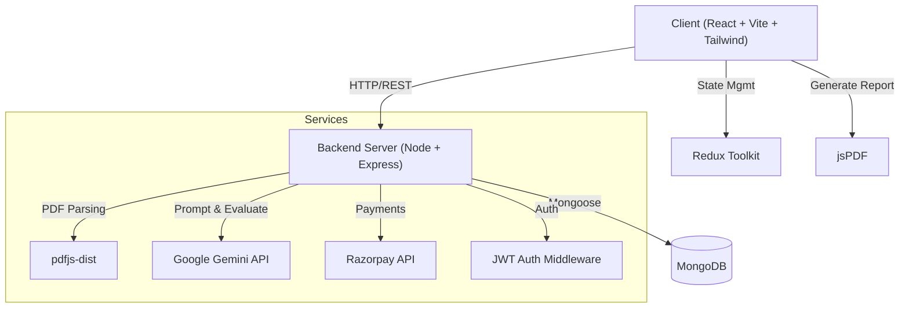

# 🚀 InterviewIQ: AI-Powered Interview Agent

[](https://reactjs.org/)
[](https://vitejs.dev/)
[](https://nodejs.org/)
[](https://expressjs.com/)
[](https://www.mongodb.com/)
[](https://tailwindcss.com/)

**InterviewIQ** is an advanced AI-driven mock interview platform designed to help job seekers prepare for real-world interviews. By analyzing your resume and understanding your specific role, experience level, and skills, the AI agent conducts a realistic, timed interview and provides immediate, actionable feedback on your answers using the powerful **Google Gemini API**.

This project showcases a complete Full-Stack architecture with AI integration, demonstrating proficiency in modern web development, API design, system architecture, and AI utilization.

---

## 🏗️ Overall Project System Design

The architecture is divided into a robust React-based frontend client, an Express/Node backend API, an AI service layer (Gemini), and a MongoDB database for state persistence.



---

## ⚙️ How It Works (Complete Flow Design)

The user journey and data flow are meticulously designed to simulate a real interview process while monetizing through a credits system:

1. **Authentication & Onboarding**: 
   - User signs up/logs in securely.
   - User is granted an initial set of credits.
2. **Resume Upload & Parsing**: 
   - Candidate uploads their resume in PDF format. 
   - The server parses the PDF text and sends it to the Gemini API to extract key information (Role, Experience, Skills, Projects) into structured JSON.
3. **Interview Configuration**: 
   - Candidate confirms the extracted details and selects the interview mode (HR or Technical).
4. **Dynamic Question Generation**: 
   - The backend constructs a highly detailed prompt containing the candidate's profile and requests exactly 5 progressive questions (Easy to Hard) from the Gemini API. 
   - *Cost:* 50 credits are deducted from the user's account.
5. **The Interview Experience**: 
   - Candidate is presented with questions one by one.
   - A strict timer is enforced (e.g., 60s for easy, 120s for hard). 
   - The candidate submits their answer before the timer runs out.
6. **Real-Time AI Evaluation**: 
   - Each answer is sent back to Gemini API alongside the original question and candidate's profile.
   - Gemini evaluates the response based on correctness, confidence, and communication, returning a score and constructive feedback.
7. **Performance Analytics & Report**: 
   - Once completed, the candidate views a detailed dashboard with Recharts visualizations.
   - Candidate can download a comprehensive PDF report of their interview performance using jsPDF.
8. **Monetization (Credits)**: 
   - When credits run low, users can purchase more via the integrated Razorpay payment gateway.

---

## 🗄️ Database Schema Design

The platform uses MongoDB to maintain application state across Users, Interviews, and Payments.

### 1. User Schema (`User`)
Handles authentication, profile info, and credit balance.
- `name` (String, required)
- `email` (String, unique, required)
- `credits` (Number, default: 100)

### 2. Interview Schema (`Interview`)
Stores the entire state of an interview, including AI-generated questions and user answers.
- `userId` (ObjectId, ref: "User")
- `role` (String)
- `experience` (String)
- `mode` (String, enum: ["HR", "Technical"])
- `resumeText` (String)
- `questions` (Array of sub-documents):
  - `question` (String)
  - `difficulty` (String)
  - `timeLimit` (Number)
  - `answer` (String)
  - `feedback` (String)
  - `score` (Number)
  - `confidence` (Number)
  - `communication` (Number)
  - `correctness` (Number)
- `finalScore` (Number, default: 0)
- `status` (String, enum: ["Incompleted", "completed"])

### 3. Payment Schema (`Payment`)
Tracks transactional records for credit top-ups via Razorpay.
- `userId` (ObjectId, ref: "User")
- `planId` (String)
- `amount` (Number)
- `credits` (Number)
- `razorpayOrderId` (String)
- `razorpayPaymentId` (String)
- `status` (String, enum: ["created", "paid", "failed"])

---

## ✨ Key Features (Wow Factors for Recruiters)

### 📄 Intelligent Resume Parsing (PDF)
- Users can upload their resumes in PDF format.
- The backend utilizes `pdfjs-dist` to read the document and the **Gemini AI model** to smartly extract structured data: **Role, Experience, Projects, and Skills**.

### 🧠 Dynamic, Context-Aware Question Generation
- Gone are the days of static question banks. InterviewIQ uses advanced prompt engineering (via the **Gemini API**) to generate exactly 5 highly relevant interview questions tailored specifically to the candidate's uploaded resume details.

### ⏱️ Real-time AI Answer Evaluation
- Users submit their answers under strict time limits.
- The **Gemini API** evaluates the submitted answers against the generated questions, assigning a **Score** and providing detailed **Constructive Feedback**.

### 💳 Credit-Based Economy & Monetization
- Incorporates a fully functional credit system. Users consume credits (e.g., 50 credits per interview).
- Integrated with **Razorpay** for seamless payment processing to top up credits.

### 📊 Comprehensive Analytics & Reporting
- Visualizes interview performance over time using **Recharts**.
- Users can download their complete interview performance reports as beautifully formatted PDFs using **jsPDF** and **jspdf-autotable**.

### 🎨 Premium User Interface & Experience
- Built with **React**, **Vite**, and **TailwindCSS** for a highly responsive, modern design.
- Uses **Framer Motion** for smooth, micro-animations that make the app feel alive and premium.

---

## 🛠️ Technology Stack

### Frontend (Client)
- **Framework:** React 19 + Vite
- **Styling:** TailwindCSS v4
- **State Management:** Redux Toolkit (`@reduxjs/toolkit`)
- **Animations:** Framer Motion (`motion`)
- **Charting:** Recharts
- **PDF Generation:** jsPDF
- **Routing:** React Router v7

### Backend (Server)
- **Runtime:** Node.js
- **Framework:** Express.js
- **Database:** MongoDB (with Mongoose ODM)
- **AI Integration:** Google Gemini API
- **Authentication:** JSON Web Tokens (JWT)
- **File Handling:** Multer (for PDF uploads)
- **Payments:** Razorpay

---

## 🚀 How to Run Locally

### Prerequisites
- Node.js (v18+)
- MongoDB (Local or Atlas URL)
- Razorpay Account (for payment API keys)
- Google Gemini API Key

### 1. Clone the repository
```bash
git clone https://github.com/PrimeSiddhesh/InterviewIQ_AI_Interview_Agent.git
cd InterviewIQ_AI_Interview_Agent
```

### 2. Setup the Backend (Server)
```bash
cd server
npm install
```
Create a `.env` file in the `server` directory and add the necessary environment variables:
```env
PORT=...
MONGODB_URI=...
JWT_SECRET=...
GEMINI_API_KEY=...
RAZORPAY_KEY_ID=...
RAZORPAY_KEY_SECRET=...
```
Start the server:
```bash
npm run dev
```

### 3. Setup the Frontend (Client)
Open a new terminal window:
```bash
cd client
npm install
```
Create a `.env` file in the `client` directory:
```env
VITE_API_URL=http://localhost:<YOUR_BACKEND_PORT>
```
Start the client:
```bash
npm run dev
```

---

## 💡 Why This Project Stands Out (For Interviewers)

1. **End-to-End Execution:** This isn't just a basic CRUD app. It combines file processing, AI orchestration, real-time evaluation, payment processing, and document generation into one cohesive product.
2. **AI as a Core Feature, Not an Afterthought:** The AI isn't just a chatbot; it actively parses documents, personalizes content, and evaluates user input dynamically via Gemini.
3. **Production-Ready Concerns:** Handles edge cases like timeouts, empty inputs, token limits, and secure transactions (Razorpay).
4. **Complex State & Architecture:** Managing timers on the client, persisting incomplete interviews in MongoDB, and processing payments show mastery of state flows and system design.
5. **Modern UI/UX:** The use of Tailwind and Framer Motion shows a strong eye for design and user experience, which is crucial for modern web development roles.

---
*Built to crack interviews, by cracking interviews.*
